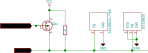

# OneWireNg

Ths is an Arduino 1-wire service library, intended as an alternative for the
classic [OneWire](https://github.com/PaulStoffregen/OneWire) library. The library
provides basic 1-wire services (reset, search, touch, read, write, parasite
powering) and may serve for further work while interfacing with various 1-wire
devices (e.g. Dallas/Maxim thermometers).

## Features

* All bus activities are performed respecting open-drain character of the 1-wire
  protocol.

  During normal 1-wire activities, the master MCU GPIO controlling the bus is
  never set high (providing direct voltage source on the bus) instead the GPIO
  is switched to the reading mode causing the high state seen on the bus via
  the pull-up resistor.

* 1-wire touch support.

  The 1-wire touch may substantially simplify complex bus activities consisting
  of write-read pairs by combining them into a single touch activity. See examples
  for details.

* Parasite powering support.

  The 1-wire bus may be powered directly by the master MCU GPIO or via a switching
  transistor controlled by a dedicated MCU GPIO, if the target platform's GPIOs
  (in the output mode) work in the open-drain mode only. More details
  [below](#parasite-powering).

* Clear and flexible architecture.

  The code architecture allows fast and easy porting for new Arduino platforms
  or even usage of the core part of library outside the Arduino environment.

## Supported platforms

* Arduino AVR.
    * Platform class: `OneWireNg_ArduinoAVR`.
    * Tested on Arduino UNO (ATmega328P).
* Arduino megaAVR (recent Microchip AVR architecture).
    * Platform class: `OneWireNg_ArduinoMegaAVR`.
    * **Not tested**.
* Arduino ESP8266.
    * Platform class: `OneWireNg_ArduinoESP8266`.
    * **Not tested**.
* Arduino ESP32.
    * Platform class: `OneWireNg_ArduinoESP32`.
    * **Not tested**.

NOTE: Expect more platforms support in the future. **I'm inviting all developers**,
eager to help me with porting and testing the library for new platforms.

## Architecture details

### OneWireNg

The class provides public interface for 1-wire service. Object of this class
isn't constructed directly rather than casted from a derived class object
implementing platform specific details.

As an example:

```cpp
OneWireNg::Id id;
OneWireNg::ErrorCode ec;

OneWireNg *ow = new OneWireNg_ArduinoAVR(10);
do
{
    ec = ow->search(id);
    if (ec == OneWireNg::EC_MORE || ec == OneWireNg::EC_DONE) {
        // `id' contains 1-wire address of a connected slave
    }
} while (ec == OneWireNg::EC_MORE);
```

creates 1-wire service interface for Arduino AVR platform and perform search on
the bus. The bus is controlled by Arduino pin number 10.

### OneWireNg_BitBang

The class is derived from `OneWireNg` and implements the 1-wire interface basing
on GPIO bit-banging. Object of this class isn't constructed directly rather than
the class is intended to be inherited by a derived class providing protected
interface implementation for low level GPIO activities (set mode, read, write).

### OneWireNg_PLATFORM

Are family of classes providing platform specific implementation (`PLATFORM`
states for a platform name e.g. `OneWireNg_ArduinoAVR` provides AVR implementation
for Arduino environment).

The platform classes implement `OneWireNg` interface directly (via direct
`OneWireNg` class inheritance) or indirectly (e.g. GPIO bit-banging implementation
bases on `OneWireNg_BitBang`, which provides GPIO bit-banging 1-wire service
implementation leaving the platform class to provide platform specific low-level
GPIO activities details).

Platform classes have a public constructor allowing to create 1-wire service for
a particular platform (see [above](#architecture-details)).

NOTE: For the convenience there has been provided `OneWireNg_CurrentPlatform.h`
header which tries to detect platform the compilation is proceeded and:
 * include proper platform class header,
 * assign `OneWireNg_CurrentPlatform` macro-define to the detected platform class.

Refer to `examples/Dallas_Temperature` example for the usage details.

## Usage

Refer to `examples` directory for usage details. For API details refer to sources
inline docs (mainly `OneWireNg` class).

## Parasite powering

The library supports two modes of providing direct voltage source on the 1-wire
bus to parasitically power connected slaves:

1. If platform's GPIO set to the high-state (in the output mode) is able to serve
   as a voltage source, the library may leverage this trait. The master MCU GPIO
   controlling the 1-wire bus is set to the high-state powering the bus when
   additional energy is needed for connected slaves.

2. If platform's GPIO in the output mode is of an open-drain type, then the GPIO
   is not able to directly serve as a voltage source powering the slaves. In this
   case additional switching transistor is leveraged to provide the power to the
   bus and is controlled by a dedicated power-control-GPIO as presented on the
   following figure.



Choice between the two types is made by selecting appropriate constructor of a
platform class. For example:

```cpp
/*
 * Macro-defines used:
 *
 * OW_PIN: GPIO pin number used for bit-banging 1-wire bus.
 * PWR_CTRL_PIN: power-control-GPIO pin number (optional).
 */

#ifdef PWR_CTRL_PIN
// switching transistor powering
OneWireNg_ArduinoAVR owAvr(OW_PIN, PWR_CTRL_PIN);
#else
// GPIO bit-bang powering
OneWireNg_ArduinoAVR owAvr(OW_PIN);
#endif

OneWireNg& ow = owAvr;

// ...

// power the bus until explicit unpowering or next 1-wire bus activity
ow.powerBus(true);

// wait for connected slaves to fulfill their task requiring extra powering
delay(750);

// unpower the bus
ow.powerBus(false);
```

configures 1-wire service to work in one of the above modes (AVR platform).

## License

2 clause BSD license. See LICENSE file for details.
