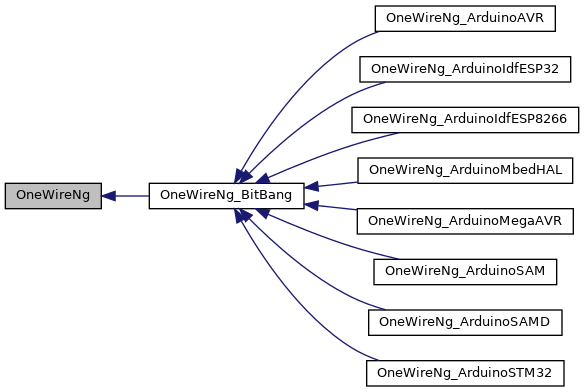

# OneWireNg

This is an Arduino 1-wire service library, intended as an alternative for the
classic [OneWire](https://github.com/PaulStoffregen/OneWire) library. The library
provides basic 1-wire services (reset, search, touch, read, write, parasite
powering) and may serve for further work while interfacing with various 1-wire
devices.

## Features

* All bus activities are performed respecting open-drain character of the 1-wire
  protocol.

  During normal 1-wire activities, the master MCU GPIO controlling the bus is
  never set high (providing direct voltage source on the bus) instead the GPIO
  is switched to the reading mode causing the high state seen on the bus via
  the pull-up resistor.

* 1-wire touch support.

  The 1-wire touch may substantially simplify complex bus activities consisting
  of write-read pairs by combining them into a single touch activity. See examples
  for details.

* Parasite powering support.

  The 1-wire bus may be powered directly by the master MCU GPIO or via a switching
  transistor controlled by a dedicated MCU GPIO. More details [below](#parasite-powering).

* Search filtering.

  Search algorithm allows efficient filtering basing on a selected set of family
  codes. Maximum size of the set is configurable by `CONFIG_MAX_SRCH_FILTERS`.

* Overdrive (high-speed) mode support.

  The overdrive mode enables speed up the 1-wire communication by a factor of 10.
  Only limited number of 1-wire devices support this mode (e.g. DS2408, DS2431).

* Dallas thermometers driver.

  [`DSTherm`](src/drivers/DSTherm.h) class provides general purpose driver for
  handling Dallas thermometers.
  See [`DallasTemperature.ino`](examples/DallasTemperature/DallasTemperature.ino)
  sketch for an example of usage.

* OneWire compatibility interface.

  The interface allows effortless switch into OneWireNg for projects using
  OneWire library. See [below](#onewire-compatibility) for details.

* Clear and flexible architecture.

  The code architecture allows fast and easy porting for new Arduino platforms
  or even usage of core part of the library outside the Arduino environment.

## Supported platforms

* Arduino AVR.
    * Platform class: `OneWireNg_ArduinoAVR`.
    * Tested on Arduino UNO (ATmega328P).
* Arduino megaAVR (recent Microchip AVR architecture).
    * Platform class: `OneWireNg_ArduinoMegaAVR`.
    * **Not tested**.
* Arduino SAM.
    * Platform class: `OneWireNg_ArduinoSAM`.
    * **Not tested**.
* Arduino SAMD/SAMD-Beta.
    * Platform class: `OneWireNg_ArduinoSAMD`.
    * **Not tested**.
* Arduino ESP8266.
    * Platform class: `OneWireNg_ArduinoESP8266`.
    * Tested on WemOS D1
* Arduino ESP32.
    * Platform class: `OneWireNg_ArduinoESP32`.
    * Tested on ESP32-DevKitC (ESP32-WROOM-32)
* Arduino STM32.
    * Platform class: `OneWireNg_ArduinoSTM32`.
    * **Not tested**.

NOTE: Expect more platforms support in the future. **I'm inviting all developers**
eager to help me with porting and testing the library for new platforms.

## Architecture details



### `OneWireNg`

The class provides public interface for 1-wire service. Object of this class
isn't constructed directly rather than casted from a derived class object
implementing platform specific details.

As an example:

```cpp
#include "OneWireNg_CurrentPlatform.h"

static OneWireNg *ow = nullptr;

void setup()
{
    OneWireNg::Id id;
    OneWireNg::ErrorCode ec;

    ow = new OneWireNg_CurrentPlatform(10);

    do
    {
        ec = ow->search(id);
        if (ec == OneWireNg::EC_MORE || ec == OneWireNg::EC_DONE) {
            // `id' contains 1-wire address of a connected slave
        }
    } while (ec == OneWireNg::EC_MORE);
}
```

creates 1-wire service interface for current platform and performs search on
the bus. The bus is controlled by MCU pin number 10.

NOTE: If heap allocation is inadvisable use in-place `new` operator:

```cpp
#include <new>
#include "OneWireNg_CurrentPlatform.h"

static OneWireNg *ow = nullptr;
static uint8_t OneWireNg_buf[sizeof(OneWireNg_CurrentPlatform)];

void setup()
{
    ow = new (OneWireNg_buf) OneWireNg_CurrentPlatform(10);
    // ...
}
```

### `OneWireNg_BitBang`

The class is derived from `OneWireNg` and implements the 1-wire interface basing
on GPIO bit-banging. Object of this class isn't constructed directly rather than
the class is intended to be inherited by a derived class providing protected
interface implementation for low level GPIO activities (set mode, read, write).

### `OneWireNg_PLATFORM`

Are family of classes providing platform specific implementation (`PLATFORM`
states for a platform name e.g. `OneWireNg_ArduinoAVR` provides AVR implementation
for Arduino environment).

The platform classes implement `OneWireNg` interface directly (via direct
`OneWireNg` class inheritance) or indirectly (e.g. GPIO bit-banging implementation
bases on `OneWireNg_BitBang`, which provides GPIO bit-banging 1-wire service
implementation leaving the platform class to provide platform specific low-level
GPIO activities details).

Platform classes have a public constructor allowing to create 1-wire service for
a particular platform (see [above](#architecture-details)).

NOTE: For the convenience there has been provided `OneWireNg_CurrentPlatform.h`
header which tries to detect platform the compilation is proceeded and:
 * include proper platform class header,
 * assign `OneWireNg_CurrentPlatform` macro-define to the detected platform class.

## Usage

Refer to [`examples`](examples) directory for usage details. For API details
refer to sources inline docs (mainly [`OneWireNg`](src/OneWireNg.h) class).

File [`src/OneWireNg_config.h`](src/OneWireNg_config.h) contains parameters
configuring the library functionality. See the file for more details.

## Overdrive mode

The mode requires very strict and short timings while bit-banging data on the
1-wire bus, therefore is vulnerable for any inaccuracies.

The mode is confirmed to work on the following platforms and CPU frequencies:

* Arduino AVR.
    * Arduino UNO (ATmega328P); 16MHz.
* Arduino ESP8266.
    * WemOS D1; 160MHz,80MHz.
* Arduino ESP32.
    * ESP32-DevKitC (ESP32-WROOM-32); 240MHz(recommended),160MHz. Errors observed.

## Parasite powering

The library supports two modes of providing direct voltage source on the 1-wire
bus to parasitically power connected slaves:

1. If platform's GPIO set to the high-state (in the output mode) is able to serve
   as a voltage source, the library may leverage this trait. The master MCU GPIO
   controlling the 1-wire bus is set to the high-state powering the bus when
   additional energy is needed for connected slaves.

2. If platform's GPIO in the output mode is of an open-drain type, then the GPIO
   is not able to directly serve as a voltage source powering the slaves. In this
   case additional switching transistor is leveraged to provide the power to the
   bus and is controlled by a dedicated power-control-GPIO as presented on the
   following figure.


Choice between the two types is made by selecting appropriate constructor of a
platform class. For example:

```cpp
#include "OneWireNg_CurrentPlatform.h"

static OneWireNg *ow = nullptr;

void setup()
{
    /*
     * Macro-defines used:
     *
     * OW_PIN: GPIO pin number used for bit-banging 1-wire bus.
     * PWR_CTRL_PIN: power-control-GPIO pin number (optional).
     */
#ifdef PWR_CTRL_PIN
    // switching transistor powering
    ow = new OneWireNg_CurrentPlatform(OW_PIN, PWR_CTRL_PIN);
#else
    // GPIO bit-bang powering
    ow = new OneWireNg_CurrentPlatform(OW_PIN);
#endif

    // ...

    // power the bus until explicit unpowering or next 1-wire bus activity
    ow->powerBus(true);

    // wait for connected slaves to fulfill their task requiring extra powering
    delay(750);

    // unpower the bus
    ow->powerBus(false);
}
```

configures 1-wire service to work in one of the above modes.

## OneWire Compatibility

[`OneWire`](src/OneWire.h) class provides compatibility interface between
OneWireNg and [OneWire](https://github.com/PaulStoffregen/OneWire) library.
The main purpose of this class is to provide fast and effortless mechanism for
developers experiencing issues with OneWire and eager to give OneWireNg a try.
Finally, it's strongly recommended to switch into OneWireNg interface rather
than stay with the OneWire due to OneWireNg's more mature and feature-rich API
(search filtering, OD mode, touch support).

## DallasTemperature library

As an example of usage of the compatibility interface there has been created
the [following fork](https://github.com/pstolarz/Arduino-Temperature-Control-Library/tree/OneWireNg)
of [DallasTemperature](https://github.com/milesburton/Arduino-Temperature-Control-Library)
library ported with OneWireNg.

## License

2 clause BSD license. See [`LICENSE`](LICENSE) file for details.
